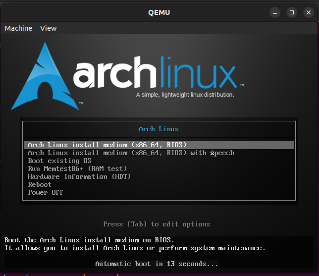
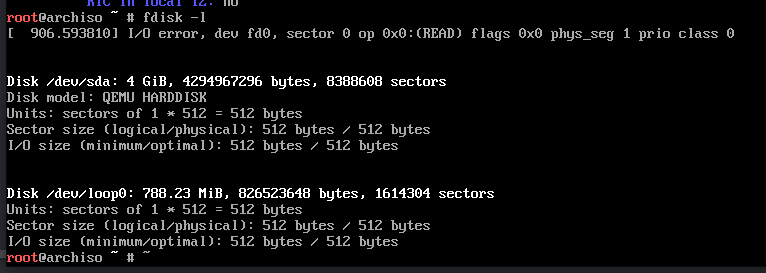
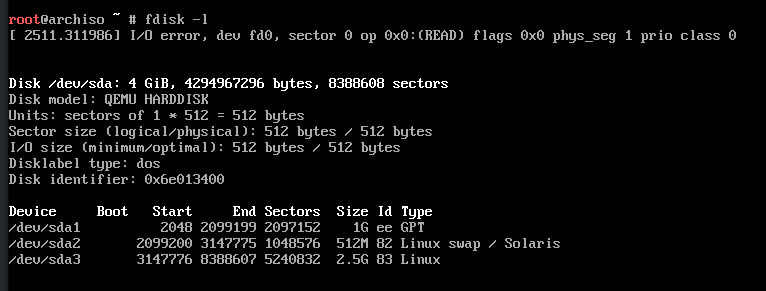
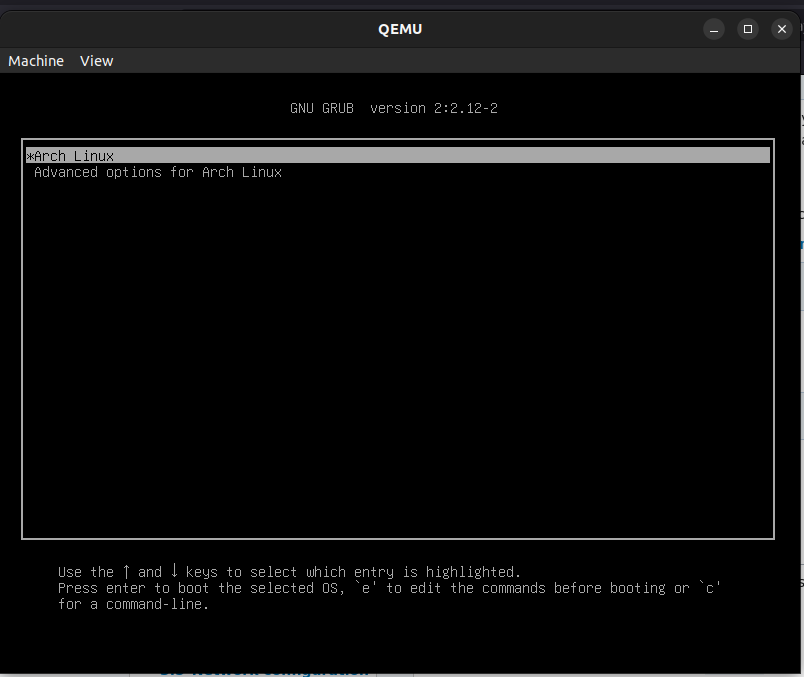
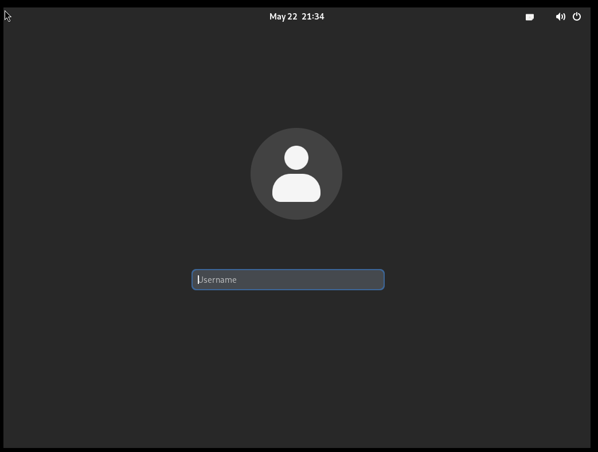

# Running Arch Linux inside Qemu

I've been meaning to try Arch Linux. I wanted to install it inside a VM first, capture notes on the installation process, then if all goes well replace it as my host OS. 

## Set up
1. Install [QEMU](https://www.qemu.org/download/)
2. Download the [Arch ISO](https://archlinux.org/download/). You want the ISO, not a VM image.   

## Create a virtual disk
Before we start, we need a "hard disk" that Arch will see as an available disk to install on. 

`qemu-img create -f raw arch.cow 8G`

Creates an 8G disk. `-f raw` is the file format. I found `raw` the most reliable. Other formats like `cow` (copy-on-write) would appear as an almost 0B disk in Arch, I assume which is caused by how the cow format works by only writing changed bytes. 

!!! tip

    You can resize the file with:  `qemu-img resize -f raw arch.cow +4G` adds an extra 4G to the disk image.

## Install Arch
Run `qemu-system-x86_64 -boot menu=on -cdrom archlinux-2024.04.01-x86_64.iso -drive file=arch.cow,format=raw -m 4G -accel kvm -cpu host`

| Option          | Description                                                                                                                                                                                                                    |
|-----------------|--------------------------------------------------------------------------------------------------------------------------------------------------------------------------------------------------------------------------------|
| `-boot menu=on` | This will show a menu that gives you the option to select some advanced options, like what device to boot from. Useful when installing Arch. After you install Arch this option can be dropped to boot straight into Arch.     |
| `-cdrom`        | Specifies the media on the 'CD ROM'. Points at the Arch ISO downloaded above.                                                                                                                                                  |
| `-drive`        | The path to the virtual disk created above                                                                                                                                                                                     |
| `-m 4G`         | 4G of memory                                                                                                                                                                                                                   |
| `-accel kvm`    | `Kernel-based Virtual Machine` acceleration. I found this to be a performance improvement [https://wiki.archlinux.org/title/QEMU#Enabling_KVM](https://wiki.archlinux.org/title/QEMU#Enabling_KVM)                             |
| `-cpu host`     | Makes QEMU emulate the host's exact CPU rather than a more generic CPU. [https://wiki.archlinux.org/title/QEMU#Improve_virtual_machine_performance](https://wiki.archlinux.org/title/QEMU#Improve_virtual_machine_performance) |

Should display this menu. Choose the first (Default) option:



The installation process is via the terminal, basically following the [Arch installation Wiki](https://wiki.archlinux.org/title/Installation_guide#Set_the_console_keyboard_layout_and_font). Some notes:

!!! tip
    
    QEMU should set up network connectivity within the VM automagically. E.g. if you're plugging in with ethernet, or on WiFi, you should have connectivity from guest to host.

    :material-close-network-outline: However! the Arch ISO is preconfigured with a networking stack that obtains an IP automatically. Whereas you need to manually install a network stack as part of the installation, and if you don't you won't have networking after rebooting into the Arch guest.

### Partition the disks
`fdisk -l` should show this:



This is the partition table we will create:

| Partition   | Type             | Size |
|-------------|------------------|------|
| `/dev/sda1` | BIOS boot        | 1M   |
| `/dev/sda2` | Linux swap       | 512M |
| `/dev/sda3` | Linux filesystem | 3.5G |


Format the virtual disk `fdisk /dev/sda`

QEMU uses a legacy BIOS by default, not UEFI. This requires a `BIOS/GPT` partition table [https://wiki.archlinux.org/title/Partitioning#BIOS/GPT_layout_example](https://wiki.archlinux.org/title/Partitioning#BIOS/GPT_layout_example)

- [Arch WIKI: GPT partition table specific instructions](https://wiki.archlinux.org/title/GRUB#GUID_Partition_Table_(GPT)_specific_instructions)

Type the following to set up a partition table:

`g` creates a new empty GPT partition table

Now create the partitions (to match the partition table above):

`n` > `<enter>` (to accept default `p` for partition type) > `<enter>` (to accept default partition number) > `<enter>` to default first sector > `+1M` to set size 

`t` > `4` > `<enter>` sets the partition type to `BIOS Boot`

`n` > `<enter>` > `<enter>` > +512M > `<enter>` creates a 512M partition we'll use for swap space.

`t` > `2` > `19` marks the second partition as a Linux swap partition.

`n` then press enter to accept every default. Creates a third partition that uses up the remaining space.

`w` saves the partition table.

Run `fdisk -l` and this time you should see the newly created partition table:



### Format partitions
`mkswap /dev/sda2` formats the 512M partition as a swap space

`mkfs.ext4 /dev/sda3` formats the third partition as EXT4.

##  Prepare for installation
The next steps will mount the Ext4 partition, install base Linux packages onto it, and generate `/etc/fstab` 

`mount /dev/sda3 /mnt` <br />
`swapon /dev/sda2`

Then install the base packages: `pacstrap -K /mnt base linux linux-firmware`

`genfstab -U /mnt >> /mnt/etc/fstab` populates `/mnt/etc/fstab` with the partition details (used by Arch to auto-mount partitions on boot)

## Install Arch
`arch-chroot /mnt` will enter a new shell whose root `/` points at `/mnt`. 

Install `nano` so we have a text editor `pacman -S nano`

`nano /etc/hostname` and type in `archiboi` as the hostname. Then `ctl + o` + `<enter>` saves the file. Then `ctl + x` to exit.

`passwd` sets the root password

### Install apps from Arch User Repository (AUR)
The Arch community can contribute their own apps, or ways to automate the installation of apps with [AUR](https://wiki.archlinux.org/title/Arch_User_Repository).

AUR bridges the gap by providing a way to install software not available through `pacman`. 

`pacman -S base-devel` installs requirements for using AUR.

`pacman -S git` installs Git, required to clone the AUR package contents.

The process to install any AUR package is as follows:

```Bash
git clone https://aur.archlinux.org/gdm-settings.git # the clone URL will be displayed on the AUR package web page
cd gdm-settings # the package name
makepkg -s # -s will install missing dependencies before building the package 
pacman -U gdm-settings-4.4-1-any.pkg.tar.zst # to install the zst package produced by makepkg
```

## Set up a user
Next, create a user. Even though `root` already exists, it's a superuser and Arch will show a warning if you log in as root.

`useradd -m archie` creates a new user archie

`passwd archie` sets the passwd for archie

### sudo
`sudo` su(peruser)do delegates permission to run system commands to the user. We want this for `archie` so we can run `sudo ` commands from the terminal. 

First, install sudo `pacman -S sudo`

Then set `nano` as the editor for `visudo` which we'll use to edit the `/etc/sudoers` file.

`EDITOR=nano visudo`

At the end of the file, add the following:

```Bash
archie  ALL=(ALL:ALL) ALL
```

archie will now have full system access when they run sudo

## Install apps 
`pacman -S gnome-terminal` installs a terminal emulator. Search "terminal emulator" for other options. 

`pacman -S firefox` installs a browser.

## Set up GRUB
Still within the `arch-chroot`: 

`pacman -S grub` installs Grub. 

`grub-install --target=i386-pc /dev/sda` installs the GRUB bootloader. 

`grub-mkconfig -o /boot/grub/grub.cfg` generates the GRUB config. `grub.cfg` controls what menu options appear on the boot screen.

At this point, installation is done. Time to reboot.

## Reboot into Arch
`exit` to exit chroot, then `reboot` to restart. 

You should see the GRUB menu:



Enter `root` as the username, and the password from the steps above. 

That's it, you're using Arch. Keep reading to install a display manager, so we can use Arch graphically, not via the terminal.

## Install Network Management software
These steps will install a DHCP client and a DNS resolver. This gives Arch internet connectivity. [Arch Wiki: Network management](https://wiki.archlinux.org/title/Network_configuration#Network_management)

`pacman -S networkmanager` installs NetworkManager. By default, Arch has `systemd-networkd` preinstalled, but GDM is compatible with NetworkManager by default. 
This means when you install GDM and `gnome-control-center`, and view Network settings, it will be able to show network config if you are using `NetworkManager`.

`systemctl enable NetworkManager.service && systemctl start NetworkManager.service` starts NetworkManager.

`ln -sf ../run/systemd/resolve/stub-resolv.conf /etc/resolv.conf` configures domain name resolution ([Arch Wiki: DNS](https://wiki.archlinux.org/title/Systemd-resolved#DNS))

`systemctl enable systemd-resolved.service && systemctl start systemd-resolved.service` starts the DNS resolver.

!!! tip

    To use systemd-networkd instead of NetworkManager:

    ```bash
    # instructs `systemd-networkd` to automatically configure the route table and configure the interface to obtain an IP via DHCP.
    ln -s /usr/lib/systemd/network/89-ethernet.network.example /etc/systemd/network/20-ethernet.network 
    systemctl enable systemd-networkd.service && systemctl start systemd-networkd.service 
    ```

Now you can `ping google.com` successfully. 

If having troubles, start with `systemctl status NetworkManager` and `journalctl -u NetworkManager` to view logs.

## Graphical User Interface
I'll use GDM - "The GNOME Display Manager", but there are other [options](https://wiki.archlinux.org/title/Display_manager#Graphical)

`pacman -S gdm`

!!! danger "Pacman errors"

    For some reason when I ran this, I got an error that one of the dependencies (llvm-libs) could not be downloaded due to a 404.
    To fix, I ran `pacman -Syyu` which synchronises the Pacman package database, then re-ran the installation of `gdm`

!!! tip "No disk space?"

    > error: not enough free disk space. 

    Stop QEMU and add space to the virtual disk: `qemu-img resize -f raw arch.cow +4G`

    Then run QEMU with -cdrom (same command as above) to enter the installation process. 

    Run `fdisk /dev/sda` then type these commands:

    `e` > `3` > `<enter>` `w`

    Then resize the partition:

    `e2fsck -f /dev/sda3` (press `y` to fix errors, if any)

    `resize2fs /dev/sda3`

    Then reboot back into Arch, and resume installing gdm

`systemctl enable gdm && systemctl start gdm` will start GDM, and the graphical user interface now appears



### Install GNOME control center
Install `gnome-control-center` package to be able to change system settings.

`pacman -S gnome-control-center`

## Capture keyboard
If you want to capture the keyboard within the VM, e.g. `ctl + alt + del` / `alt + tab`, focus the QEMU window (by clicking on it), then `ctl + alt + g`.

To stop capturing the keyboard, focus QEMU and type `ctl + alt + g` again.

## Boot straight into Arch
Drop the `-cdrom` option to boot straight into Arch:

`qemu-system-x86_64 -drive file=arch.cow,format=raw -m 4G -accel kvm -cpu host -smp 4`

`-smp 4` supplies 4 CPU cores to the VM.

## Next steps
Personally, I would recommend the following apps / changes:

1. Change your default shell from `bash` to `zsh` (`pacman -S zsh`)
2. Install **Oh My Zsh** [https://ohmyz.sh/#install](https://ohmyz.sh/#install) which configures zsh for some insanely handy features
3. Install **Oh My Posh** [https://ohmyposh.dev/](https://ohmyposh.dev/) to pimp your terminal. It makes you look like a h4ck3r but is also a very
beautiful way to present lots of contextual information in your terminal. E.g. when you're in a folder with a `.git` file, it shows
what branch you're checked out on, how far ahead or behind your local branch is.
4. Install a Nerd Font, [https://www.nerdfonts.com/](https://www.nerdfonts.com/), and configure the Terminal emulator to use it, making it look extra smooth and supports Glyphs (icons in the terminal)

Happy hacking

<figure markdown="span">

    { align=left }

</figure> 


## Next blog posts (TODO!)
- Set up sound to pass from Guest -> Host https://mathiashueber.com/virtual-machine-audio-setup-get-pulse-audio-working/
- Install libvirt and a GUI for managing VMs https://cockpit-project.org/
- SSHing into the VM
- Set up libvirt https://libvirt.org/drvqemu.html